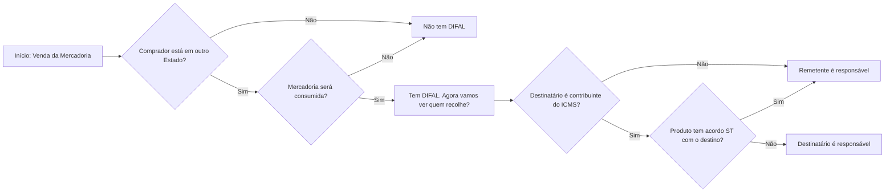

# Trilha do ICMS Diferencial de Alíquotas

Imagem (paisagem): [trilha-icms-difal-paisagem.png](./trilha-icms-difal-paisagem.png)

## Mermaid

## Notas GNRE

- Destinatário **não** contribuinte → campo NF-e **ICMS UF Destino** | GNRE `100102` (não inscrito) / `100110` (inscrito)
- Destinatário contribuinte **com** acordo ST → campo NF-e **ICMS ST** | GNRE `100099` (não inscrito) / `100048` (inscrito)
